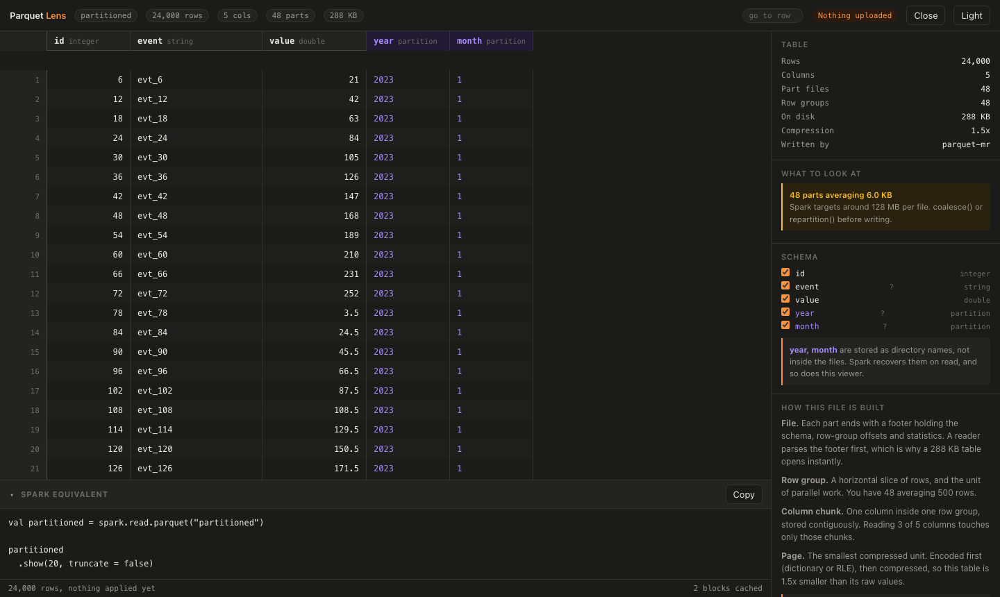

# Parquet Lens

A drag-and-drop viewer for the Parquet tables Spark writes. Runs entirely in your browser: nothing is
uploaded, nothing is installed, and the data never leaves your machine.



## Why

Every other browser Parquet viewer assumes a single `.parquet` file. Spark doesn't write a file, it
writes a **directory**:

```
events/
├── _SUCCESS
├── year=2024/
│   └── month=06/
│       ├── part-00000-a1b2c3-c000.snappy.parquet
│       └── part-00001-a1b2c3-c000.snappy.parquet
└── year=2023/...
```

Drop that whole directory here and it opens as **one logical table**. The part files are stitched
together, and `year` and `month`, which exist only as directory names and appear nowhere inside the
parquet data, come back as real columns.

## Getting started

```bash
git clone https://github.com/abid-mahdi/parquet-lens.git
cd parquet-lens
npm install
npm run dev
```

No JVM, no Spark, no Docker. Node 22+ is the only requirement.

## What it does

- **Reads a Spark output directory as one table.** Part files, `_SUCCESS`, `.crc` sidecars and
  Hive-style partition directories are all handled.
- **Recovers partition columns** from directory names and marks them visually, because they behave
  differently from stored columns.
- **Shows the original Spark schema**, decoded from the `org.apache.spark.sql.parquet.row.metadata`
  footer key, so `DecimalType(18,4)` reads as itself rather than as `FIXED_LEN_BYTE_ARRAY`.
- **Click-through inspection.** A row opens a detail drawer with nested structs, arrays and maps
  expanded. A column header opens a profile with encodings, codec, null counts, per-row-group min/max
  and compression ratio. A part scopes the grid to exactly the rows one Spark task would read.
- **A legend bound to your file.** It explains file, row group, column chunk and page using the actual
  numbers in front of you, and flags what is actually wrong: the small-file problem when your parts
  average 35 KB, uneven parts when one holds several times the median (the usual reason a stage drags),
  INT96 legacy timestamps, missing statistics, and parts whose schema disagrees.
- **Your clicks compose into a real Spark command.** Sort a column, filter a value, pick columns, scope
  to a part, and the panel at the bottom accumulates the Scala you would have typed. Copy it and paste it
  into `spark-shell`.
- **Those clicks actually run.** Filters and sorts are executed against the file, not just printed, and
  the panel reports how much work was avoided: `11 of 12 row groups skipped unread`, `3 partitions
  pruned`. That is predicate pushdown and partition pruning, shown on your own data.

## Performance

Measured against a real Spark table of 5,000,000 rows across 40 columns and 16 part files, 469 MB on
disk, in headless Chromium on an M-series Mac:

| Metric | Budget | Measured |
| --- | --- | --- |
| First rows painted after drop | < 1000 ms | **236 ms** |
| Sustained scroll, p95 frame | < 24 ms | **18.2 ms** |
| Frames over 50 ms during a 6 s scroll | 0 | **0** |
| Jump to the middle of the table | < 700 ms | **160 ms** |
| Heap after scrolling 800,000 rows | < 500 MB | **125 MB** |

These are enforced as tests, not aspirations. `npm run test:e2e` fails the build if any budget regresses.

How it holds up:

- **Only the footer is read on open.** File size barely affects open time.
- **Decode runs in a Web Worker**, so scrolling never competes with decompression.
- **Rendering never waits on data.** Visible rows come from cache or render as skeletons; only the
  settled viewport triggers a fetch, and superseded requests are dropped.
- **Both axes are virtualized**, which is what makes a 200-column table survive.
- **Read windows use the page index** rather than widening to the row group. Spark often writes one
  row group per part, and widening a 256-row request to a 312,000-row group was a 6x penalty on open
  and 13x on seeking.

## Architecture

```
src/core/      pure TypeScript, no React, runs headless in Node
src/worker/    parquet decoding off the main thread
src/hooks/     the windowed row store
src/ui/        grid, legend, inspectors
```

`src/core` has no browser dependency, so the majority of the test suite runs in plain Node against real
fixtures with no browser at all.

Deeply nested data is covered explicitly: a fixture with five levels of struct, `array<array<array<int>>>`,
`map<string, array<struct<..., array<double>>>>` and nulls seeded at every depth. hyparquet returns
`undefined` for a null inside a nested value, which `JSON.stringify` then drops entirely, so nulls are
normalized back before display or an explicitly-null field would silently vanish.

Five runtime dependencies: `react`, `react-dom`, `@tanstack/react-virtual`, `hyparquet`,
`hyparquet-compressors`.

## Testing

```bash
npm test          # 122 unit tests, pure Node, under a second
npm run test:e2e  # 28 browser tests + 4 performance budgets
npm run lint
npm run typecheck
```

Fixtures are authored by **real Spark 3.3.2**, not hand-rolled approximations, so they carry authentic
part naming, `_SUCCESS` markers, `.crc` sidecars, Hive partition directories and Spark's footer
metadata. The small ones are committed, so tests need no JVM. To regenerate or to build the large
performance fixture:

```bash
./tools/fixture-gen/run.sh fixtures          # the committed set
./tools/fixture-gen/run.sh fixtures --big    # adds the 469 MB perf fixture (gitignored)
```

That script needs Java 11 and sbt. Nothing else in the project does.

## Building a query by clicking

| Click | Clause | What it does |
| --- | --- | --- |
| Column header | opens the profile | encodings, codec, nulls, min/max, compression |
| Shift-click header | `.orderBy(...)` | sorts without opening anything |
| Sort ↑ / ↓ in the profile | `.orderBy(...)` | scans that column and reorders |
| Filter in the profile | `.filter(...)` | skips row groups whose statistics cannot match |
| `filter` beside a row value | `.filter($"col" === value)` | filter straight from a cell |
| Schema checkbox | `.select(...)` | projects the grid and the command |
| A part in the legend | reads one file | the slice a single Spark task would read |

Every clause is a removable chip, and `Reset` clears them all.

Keyboard: `↑`/`↓` move a row, `PageUp`/`PageDown` move a screen, `Home`/`End` jump to the ends, `Esc`
dismisses, `Cmd/Ctrl+C` copies the selected row as JSON. `go to row` in the header jumps anywhere.

Filtering a **partition** column prunes whole directories without opening a parquet file. Filtering a
**data** column uses each row group's min/max statistics to skip groups that cannot contain a match. The
panel reports both, which makes pushdown visible on data you recognise.

## Not in this version

- **Multi-column sort and OR across filters.** Filters combine with AND and one sort column at a time.
- **Aggregation** (`groupBy`, `count`, `avg`). That wants a real query engine; DuckDB-WASM is the honest
  home for it, and at ~40 MB it would undermine the instant open this is built around.
- **Remote files over HTTP range requests.** `hyparquet` supports it; the UI doesn't expose it yet.

## Privacy

There is no server and no upload. Files are read in the tab via `Blob.slice`, and a test asserts that
zero network requests leave the origin after a file is opened.

## License

MIT
